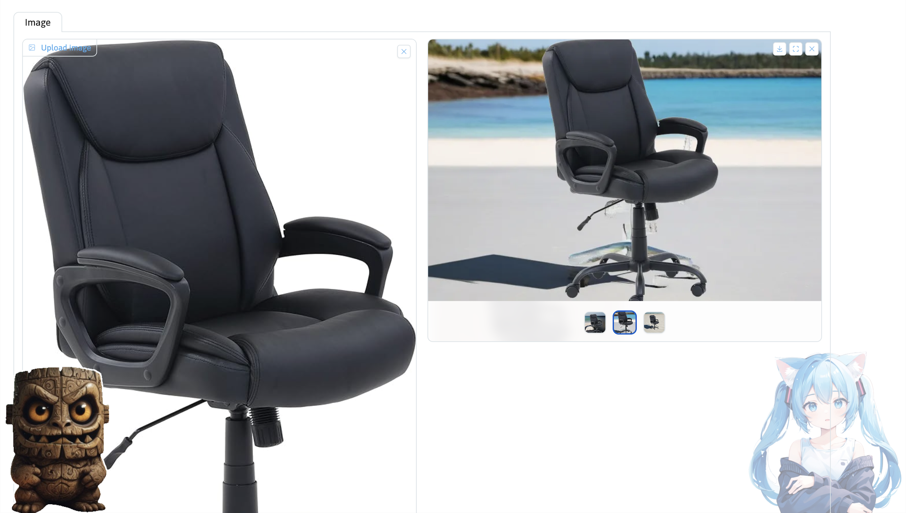
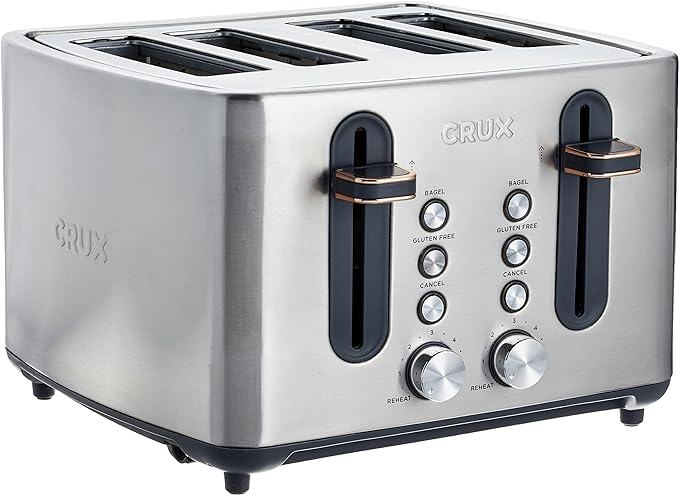
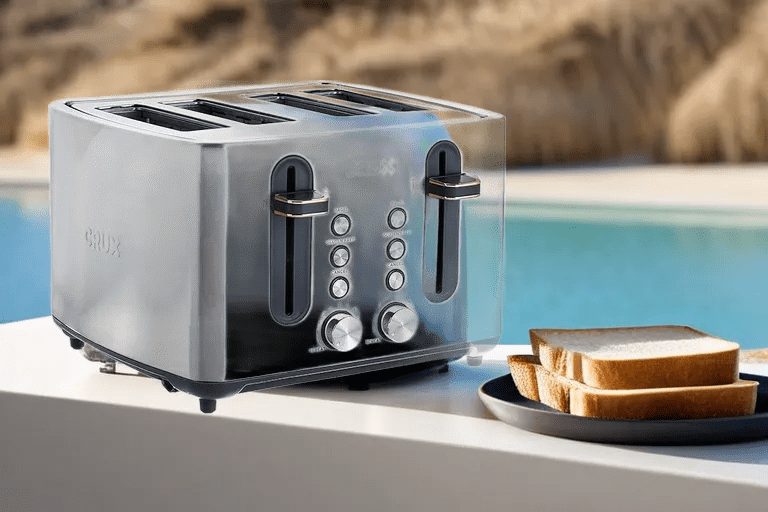
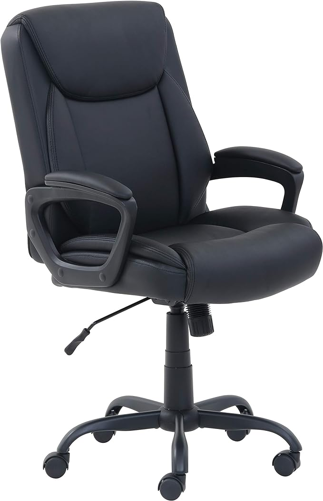

# Product Consistent Image Generation

#### Hardware Requirements: NVIDIA L4 GPU with CUDA 12.1 installed

This project is my attempt at generating AI images without distorting real images. It takes a different approach compared to the [conventional method](https://huggingface.co/spaces/ameerazam08/SAM_SDXL_Inpainting).

This approach combines several techniques to maintain the consistency and quality of the generated images. Follow these steps to set up the project environment and install the required dependencies.

## Architecture


## Download Model Weights

To begin, download, unzip and place the necessary model weights:

```sh
pip install gdown==5.2.0
gdown 'https://drive.google.com/uc?id=1TjkRSjDaAkixo0tWOFQEXrnau-xwDNeY'

unzip consistent_product_image_generation.zip
mv consistent_product_image_generation/model_weights ./
mv consistent_product_image_generation/checkpoints ./
mv consistent_product_image_generation/isnet-general-use.pth ./background_removal/bg_models/
rm -rf consistent_product_image_generation/ consistent_product_image_generation.zip
```

## Installation Steps for Local Environment

1. **Set up a virtual environment:**

   ```sh
   python3 -m venv product_env
   source product_env/bin/activate
   ```

2. **Install PyTorch and related packages:**

   ```sh
   pip install torch==2.3.1 torchvision==0.18.1 torchaudio==2.3.1 --index-url https://download.pytorch.org/whl/cu121
   ```

3. **Install the remaining dependencies from `requirements.txt`:**

   ```sh
   pip install packaging==24.1 wheel==0.41.2
   pip install -r requirements.txt
   ```

## Or Run via Docker

If you prefer to run the project in a Docker container, you can do so with the following commands:

```sh
docker build -t test .
docker run --gpus all test
```

## User Interface

- **Light Mode**: 
- **Dark Mode**: 

## Sample Results

| **Input Image**                         | **Output Image**                        |
|-----------------------------------------|-----------------------------------------|
|      |    |
|      |    |
|      |    |
|      |    |
|      |    |


### Feel free to contribute!  
## Don't forget to star the repo 😉
